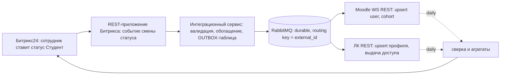

# Задание 3: интеграция Битрикс24 ↔ Moodle ↔ Личный кабинет студента

## Контекст

| Система | Роль | Стадия |
| --- | --- | --- |
| Битрикс24 on-prem (КП-100) | CRM приёмной кампании, КЭДО, БП, портал сотрудников | прод |
| Moodle 5.2 | учебный процесс: курсы, материалы, задания, оценки | прод, внедряется |
| Личный кабинет студента (ЛК) | наш сервис, свой бэк и фронт | готовится к разработке |

Масштаб: 350 активных студентов, до 100 новых лидов в пик приёмной кампании, 150 сотрудников. Всё on-prem в виртуалках одного кластера. Объёмы крошечные дляMessage-брокера — поэтому архитектуру выбираем не «по нагрузке», а **по гарантиям доставки и автономности систем**.

Триггер: сотрудник в Битриксе переводит абитуриента в статус «Студент» → должна появиться учётка в Moodle и в ЛК, студент попадает в свою учебную группу; дальнейшие изменения данных и статуса идут из Битрикса.

## Принципы

1. **У каждого типа данных ровно один мастер** (источник истины), остальные системы — подписчики. Нет взаимной синхронизации «напрямую».
2. **Событийная асинхронная интеграция через очередь** с гарантией at-least-once и идемпотентными обработчиками (upsert по ключу). Дубли невозможны конструктивно, а не «ловятся».
3. **Связка систем — по идентификатору источника**: `external_id` = ID сущности в Битриксе. В Moodle он пишется в `idnumber`, в ЛК — уникальный ключ профиля. Естественные ключи (email, ФИО) — не ключи связывания.
4. **Минимизация ПДн**: в Moodle уходят только учебно-необходимые данные; КЭДО-документы из Битрикса не выходят вообще.
5. Интеграция — **отдельный сервис** (своя ВМ/контейнеры: приложение + брокер), не встраивается ни в одну из трёх систем.

## Кто мастер по каким данным

| Данные | Мастер | Реплики и режим |
| --- | --- | --- |
| ФИО, контакты, документами | **Битрикс24** (CRM) | Moodle: ФИО + email (минимум); ЛК: профиль целиком. Push при изменении |
| Статус (лид / абитуриент / студент / отчислен) | **Битрикс24** | Обе системы. Push. Отчисление → Moodle `suspended=1` (не удаляем — нужна история), ЛК — блокировка входа |
| Учебная группа, программа | **Битрикс24** (справочник в CRM, сотрудник назначает) | Moodle: cohort 1:1 с учебной группой + cohort-sync автозапись в курсы; ЛК — атрибут профиля |
| Курсы, материалы, задания, оценки, занятия | **Moodle** | ЛК — витрина оценок/расписания для студента; Битрикс — агрегаты в карточке студента (суточная репликация) |
| Учётные данные | каждая система своя (ЛК и Moodle), связь через `external_id` | **Пароли по шине не передаются**. Аутентификация в Moodle — OAuth2 через ЛК (ЛК = IdP) |

## Поток зачисления (основной сценарий)

1. Сотрудник меняет статус в CRM (или БП делает это автоматически).
2. REST-приложение Битрикса (подписка на событие смарт-процесса) шлёт сообщение в интеграционный сервис: `{event_id, external_id, событие: ENROLLED/UPDATED/EXPELLED, версия, payload}`.
3. Интеграционный сервис пишет сообщение в **outbox-таблицу своей БД той же транзакцией**, что и запись маппинга: даже при падении сервиса сразу после приёма событие не потеряно.
4. Воркер вычитывает outbox и публикует в очередь (durable, publisher confirm). Routing по `external_id` — сообщения про одного человека обрабатываются по порядку.
5. Консьюмер Moodle: `core_user_get_users_by_field(idnumber)` → нет пользователя → `core_user_create_users` (username детерминированный из external_id, auth=oauth2) → есть — `core_user_update_users`; затем `core_cohort_add_cohort_members` в cohort его группы.
6. Консьюмер ЛК: `PUT /api/v1/students/{external_id}` — upsert, уникальный индекс по `external_id`; ЛК сам выдаёт первичный доступ (ссылка/пароль по email) и дальше служит IdP для Moodle.
7. Оба обработчика пишут в журнал доставки: `NEW → SENT → ACKED | FAILED → DEAD`, хранят `event_id`.

Обновление данных и статуса — тот же поток, событие UPDATED; отчисление — EXPELLED (suspend в Moodle, блокировка в ЛК).

Обратные потоки: Moodle → ЛК (оценки, расписание — по событиям/крону Moodle WS), агрегаты и статусы учебной активности → Битрикс (суточная витрина, чтобы сотрудник видел успеваемость в карточке, не покидая CRM).

## Способ передачи: что выбрал и что отверг

| Вариант | Решение | Почему |
| --- | --- | --- |
| Синхронные HTTP-вызовы из обработчика события Битрикса прямо в Moodle/ЛК | ❌ отверг | Недоступность получателя = потерянное событие (в коробке нет надёжного retry исходящих HTTP); сбой Moodle тормозит работу сотрудника в CRM; связывает доступность систем |
| Синхронизация по расписанию (крон-дифф всех систем) | ❌ отверг как основной | Минуты-часы лага, инкрементальный дифф трёх систем сложен и хрупок, лишняя нагрузка. Остался в роли **сверки** (reconciliation), не доставки |
| Прямые связки Moodle↔Битрикс, ЛК↔Битрикс без посредника | ❌ отверг | N×M контрактов, логика маппинга размазана, нет единого журнала доставки; любая новая система — новая паутина |
| Moodle-плагин, сам вычитывающий Битрикс | ❌ отверг | Логика зачисления внутри чужой системы; обновления Moodle будут ломать плагин; Moodle — не мастер по студентам |
| **Асинхронная очередь + outbox + идемпотентные upsert-консьюмеры** | ✅ выбран | События не теряются при недоступности любого участника; системы автономны; задержка — секунды; есть единая точка наблюдаемости доставки |

Очередь — RabbitMQ (durable queues, publisher confirms, DLX). Для объёмов 350 студентов/100 лидов в день этого с запасом; Kafka и т.п. — оверкилл. Внутри Битрикса событие достаёт REST-приложение (event handler) — штатный механизм коробки, без доработок ядра.

## Moodle недоступен 6 часов — сценарий

- Сотрудник в Битриксе продолжает работать как обычно: события пишутся в outbox и очередь. Ничего не блокируется и не теряется.
- Консьюмер Moodle ретраит с экспоненциальным backoff (1→2→4…мин, потолок 15) и уходит в паузу по health check.
- Мониторинг поднимает алерт в первые минуты (проверка доступности + «возраст самого старого необработанного сообщения»), дежурный видит причину.
- После восстановления очередь разгребается в порядке очереди: при нашей нагрузке даже часовой пик (100 событий) обрабатывается за единицы минут; 6 часов простоя → минуты догоняющей репликации. Лавины нет: prefetch + естественный темп.
- Пользовательский эффект: студенты, зачисленные в окно простоя, получают доступ в Moodle с задержкой; ЛК при этом работает полноценно (он независим). В карточке сотрудника — индикатор «доставка в Moodle: отставание N мин» из метрик очереди, чтобы не «передавали повторно» вручную.
- Анти-хрупкость: никакой попытки «продублировать руками» — это ровно тот случай, для которого очередь и поставлена.

## Как узнаю, что запись не доехала, и как передам повторно без дубля

**Обнаружение (три слоя):**

1. **Синхронно** — журнал доставки и метрики: глубина очереди, возраст старейшего сообщения, error rate, размер DLQ → алерты (Zabbix/Grafana). Не доехавшее событие видно в админке интеграционного сервиса со статусом FAILED/DEAD и текстом ошибки.
2. **Автоматически** — после N неудачных попыток сообщение уходит в DLQ; редрайв — кнопкой в админке, тем же `event_id`.
3. **Ежедневная сверка (reconciliation)** — сравнение списков `external_id` «студентов Битрикса» vs пользователей Moodle vs профилей ЛК; расхождения автоматически порождают повторную отправку события и отчёт. Это страховка от молчаливой порчи (например, кто-то руками удалил пользователя).

**Без дублей (идемпотентность):**

- Повторная доставка = то же сообщение с тем же `event_id`; обработчик ведёт таблицу `processed_events` с уникальным индексом по `event_id` — повторный приём отбрасывается.
- Даже при потере этой записи создание — **create-if-absent по натуральным ключам**: в Moodle перед созданием ищем пользователя по `idnumber = external_id` (и username детерминированный), в ЛК — `PUT` upsert с уникальным индексом в БД. At-least-once поверх upsert даёт эффективно exactly-once видимость.
- Порядок: сообщения одного человека идут по одному маршруту (routing key = external_id) + проверка версии payload — старая версия не перетрёт новую.

## Безопасность и ПДн

- Всё в закрытом контуре кластера; Moodle WS и API ЛК — по токенам сервис-аккаунтов, из сегмента интеграционного сервиса; TLS внутри.
- Минимальный набор в Moodle: username, ФИО, email, idnumber, auth=oauth2. Телефоны/документы/КЭДО — не покидают Битрикс.
- Логи доставки не содержат ПДн (только external_id и типы событий).

## Чего не хватило и какие допущения принял

1. **Датамодель Битрикса.** Что именно «абитуриент/студент»: лид, сделка, смарт-процесс, контакт? Допустил: смарт-процесс «Абитуриенты/Студенты», перевод = смена этапа; состав статусов не видел.
2. **Ключ связки и дубли.** Есть ли у одного человека несколько контактов в CRM? Допустил, что external_id = ID контакта/сделки стабилен; слияние дублей в CRM должно порождать событие перенаклейки external_id — кейс учтён, но не спроектирован детально.
3. **Аутентификация.** Есть ли корпоративный IdP/AD, какой протокол SSO? Допустил: ЛК становится OAuth2-провайдером для Moodle; без SSO — первичный пароль выдаёт ЛК по email.
4. **Состав учебных сущностей.** Группа/поток/программа — как моделируются в Битриксе и как мапятся в Moodle (cohort vs course groups)? Допустил: cohort 1:1 учебной группе + cohort sync на курсы.
5. **ПДн-требования.** 152-ФЗ, внутренние политики: что можно хранить в Moodle/ЛК. Допустил минимум, описанный выше; нужна явная норма.
6. **Лицензии.** «Корпоративный портал 100» при 150 сотрудниках — похоже, нужны дополнительные лицензии; в CRM-пользователей и лимиты REST коробки надо свериться.
7. **SLA по лагу.** Насколько срочно учётка должна существовать после перевода статуса? Допустил «минуты достаточно» (не секундные) — это и позволило асинхронную схему.
8. **Обратные потоки.** Какие данные из Moodle нужны сотрудникам в карточке студента и с какой свежестью? Допустил суточные агрегаты (оценки, посещаемость, задолженности).
9. **Инфраструктура.** Один кластер виртуалок = общая точка отказа; допустил, что кластер отказоустойчив, но брокеру и интеграционному сервису отвёл отдельные ВМ с бэкапами. Отдельный вопрос — DR-план кластера целиком.
10. **Moodle-конфигурация.** Включены ли web services, какой токен и права, лимиты; Moodle 5.2 API для cohorts — допустил admin-токен со стандартным набором функций.
11. **Владелец интеграции.** Кто дежурит по DLQ и сверкам, куда падают алерты — нет информации, принял, что есть дежурный контур поддержки.
12. **Пиковая семантика «100 лидов».** В день или одновременно? Для очереди это несущественно, но от этого зависит пиковый профиль Битрикс-REST — уточнить.

## Что бы я сделал следующим шагом

Пилотный контур: интеграционный сервис (outbox + RabbitMQ + два консьюмера) на одной зачислительной кампании в тестовом контуре, метрики доставки и сверка — до подключения ЛК; ЛК подключается консьюмером без изменения контрактов.
